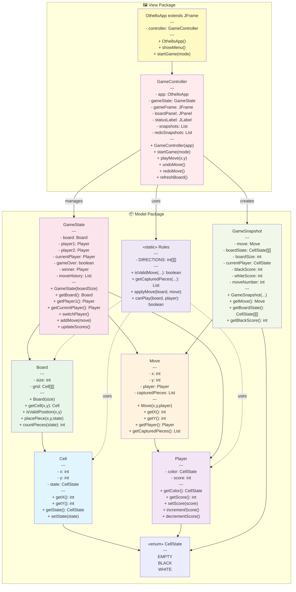
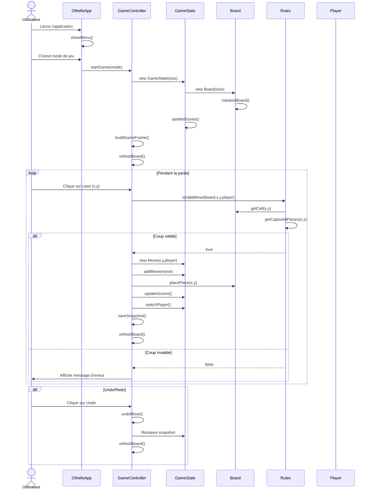
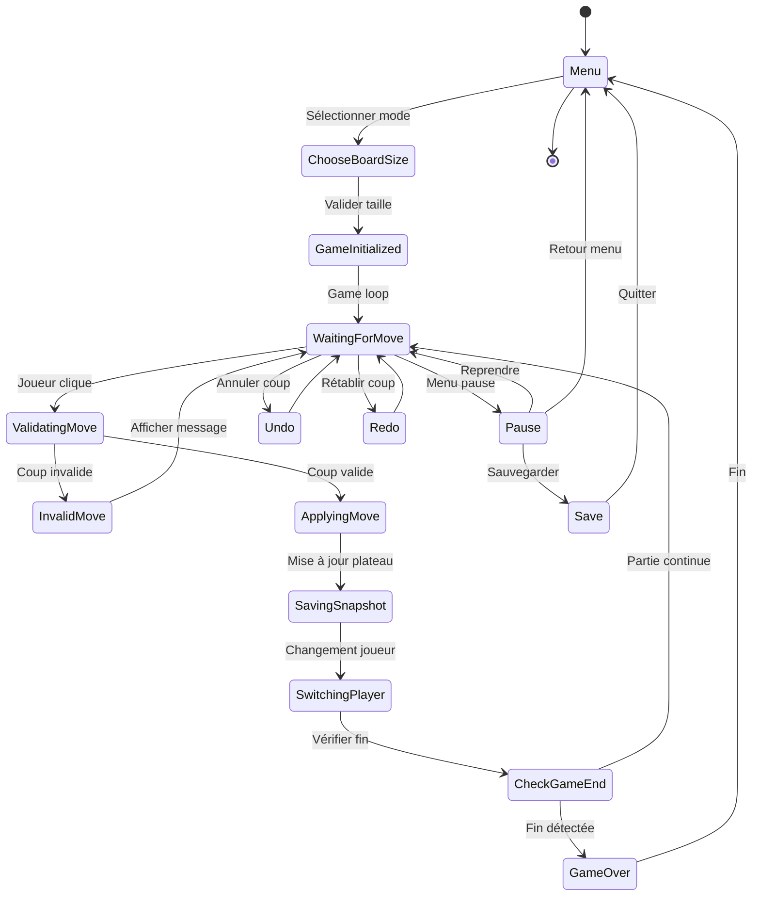
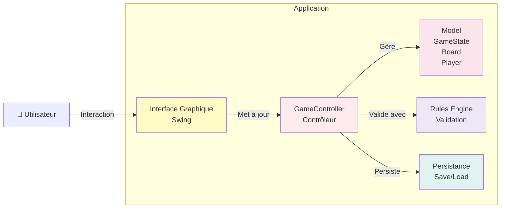

```mermaid
graph TD
    subgraph model["📦 Model Package"]
        Cell["Cell<br/>---<br/>- x: int<br/>- y: int<br/>- state: CellState<br/>---<br/>+ getX(): int<br/>+ getY(): int<br/>+ getState(): CellState<br/>+ setState(state)"]
        
        CellState["«enum» CellState<br/>---<br/>EMPTY<br/>BLACK<br/>WHITE"]
        
        Player["Player<br/>---<br/>- color: CellState<br/>- score: int<br/>---<br/>+ getColor(): CellState<br/>+ getScore(): int<br/>+ setScore(score)<br/>+ incrementScore()<br/>+ decrementScore()"]
        
        Board["Board<br/>---<br/>- size: int<br/>- grid: Cell[][]<br/>---<br/>+ Board(size)<br/>+ getCell(x,y): Cell<br/>+ isValidPosition(x,y)<br/>+ placePiece(x,y,state)<br/>+ countPieces(state): int"]
        
        Move["Move<br/>---<br/>- x: int<br/>- y: int<br/>- player: Player<br/>- capturedPieces: List<int[]><br/>---<br/>+ Move(x,y,player)<br/>+ getX(): int<br/>+ getY(): int<br/>+ getPlayer(): Player<br/>+ getCapturedPieces(): List"]
        
        GameState["GameState<br/>---<br/>- board: Board<br/>- player1: Player<br/>- player2: Player<br/>- currentPlayer: Player<br/>- gameOver: boolean<br/>- winner: Player<br/>- moveHistory: List<Move><br/>---<br/>+ GameState(boardSize)<br/>+ getBoard(): Board<br/>+ getPlayer1(): Player<br/>+ getCurrentPlayer(): Player<br/>+ switchPlayer()<br/>+ addMove(move)<br/>+ updateScores()"]
        
        GameSnapshot["GameSnapshot<br/>---<br/>- move: Move<br/>- boardState: CellState[][]<br/>- boardSize: int<br/>- currentPlayer: CellState<br/>- blackScore: int<br/>- whiteScore: int<br/>- moveNumber: int<br/>---<br/>+ GameSnapshot(...)<br/>+ getMove(): Move<br/>+ getBoardState(): CellState[][]<br/>+ getBlackScore(): int"]
        
        Rules["«static» Rules<br/>---<br/>- DIRECTIONS: int[][]<br/>---<br/>+ isValidMove(...): boolean<br/>+ getCapturedPieces(...): List<br/>+ applyMove(board, move)<br/>+ canPlay(board, player): boolean"]
        
        Cell --> CellState
        Player --> CellState
        Move --> Player
        Board --> Cell
        GameState --> Board
        GameState --> Player
        GameState --> Move
        GameSnapshot --> Move
        GameSnapshot --> CellState
        Rules -.->|uses| Board
        Rules -.->|uses| Cell
        Rules -.->|uses| Player
    end
    
    subgraph view["🖼️ View Package"]
        OthelloApp["OthelloApp extends JFrame<br/>---<br/>- controller: GameController<br/>---<br/>+ OthelloApp()<br/>+ showMenu()<br/>+ startGame(mode)"]
        
        GameController["GameController<br/>---<br/>- app: OthelloApp<br/>- gameState: GameState<br/>- gameFrame: JFrame<br/>- boardPanel: JPanel<br/>- statusLabel: JLabel<br/>- snapshots: List<GameSnapshot><br/>- redoSnapshots: List<GameSnapshot><br/>---<br/>+ GameController(app)<br/>+ startGame(mode)<br/>+ playMove(x,y)<br/>+ undoMove()<br/>+ redoMove()<br/>+ refreshBoard()"]
        
        OthelloApp --> GameController
    end
    
    GameController -->|manages| GameState
    GameController -->|creates| GameSnapshot
    GameController -->|uses| Rules
    
    style Cell fill:#e1f5ff
    style Player fill:#f3e5f5
    style Board fill:#e8f5e9
    style Move fill:#fff3e0
    style GameState fill:#fce4ec
    style GameSnapshot fill:#f1f8e9
    style Rules fill:#ede7f6
    style OthelloApp fill:#fff9c4
    style GameController fill:#ffebee
```

## Diagramme de Séquence - Déroulement d'une Partie

```mermaid
sequenceDiagram
    actor User as Utilisateur
    participant App as OthelloApp
    participant Ctrl as GameController
    participant GS as GameState
    participant Board as Board
    participant Rules as Rules
    participant Player as Player

    User->>App: Lance l'application
    App->>App: showMenu()
    
    User->>App: Choisit mode de jeu
    App->>Ctrl: startGame(mode)
    
    Ctrl->>GS: new GameState(size)
    GS->>Board: new Board(size)
    Board->>Board: initializeBoard()
    GS->>GS: updateScores()
    
    Ctrl->>Ctrl: buildGameFrame()
    Ctrl->>Ctrl: refreshBoard()
    
    loop Pendant la partie
        User->>Ctrl: Clique sur case (x,y)
        Ctrl->>Rules: isValidMove(board,x,y,player)
        Rules->>Board: getCell(x,y)
        Rules->>Rules: getCapturedPieces(x,y)
        
        alt Coup valide
            Rules-->>Ctrl: true
            Ctrl->>GS: new Move(x,y,player)
            Ctrl->>GS: addMove(move)
            Ctrl->>Board: placePiece(x,y)
            Ctrl->>GS: updateScores()
            Ctrl->>GS: switchPlayer()
            Ctrl->>Ctrl: saveSnapshot()
            Ctrl->>Ctrl: refreshBoard()
        else Coup invalide
            Rules-->>Ctrl: false
            Ctrl->>User: Affiche message d'erreur
        end
    end
    
    alt Undo/Redo
        User->>Ctrl: Clique sur Undo
        Ctrl->>Ctrl: undoMove()
        Ctrl->>GS: Restaure snapshot
        Ctrl->>Ctrl: refreshBoard()
    end
```

## Diagramme d'États - Cycle de Vie de la Partie

```mermaid
stateDiagram-v2
    [*] --> Menu
    
    Menu --> ChooseBoardSize: Sélectionner mode
    ChooseBoardSize --> GameInitialized: Valider taille
    
    GameInitialized --> WaitingForMove: Game loop
    
    WaitingForMove --> ValidatingMove: Joueur clique
    ValidatingMove --> InvalidMove: Coup invalide
    InvalidMove --> WaitingForMove: Afficher message
    
    ValidatingMove --> ApplyingMove: Coup valide
    ApplyingMove --> SavingSnapshot: Mise à jour plateau
    SavingSnapshot --> SwitchingPlayer: Changement joueur
    SwitchingPlayer --> CheckGameEnd: Vérifier fin
    
    CheckGameEnd --> WaitingForMove: Partie continue
    CheckGameEnd --> GameOver: Fin détectée
    
    WaitingForMove --> Pause: Menu pause
    Pause --> WaitingForMove: Reprendre
    Pause --> Menu: Retour menu
    Pause --> Save: Sauvegarder
    Save --> Menu: Quitter
    
    WaitingForMove --> Undo: Annuler coup
    Undo --> WaitingForMove
    
    WaitingForMove --> Redo: Rétablir coup
    Redo --> WaitingForMove
    
    GameOver --> Menu: Fin
    Menu --> [*]
```

## Architecture Générale

```mermaid
graph LR
    subgraph Application
        direction TB
        UI["Interface Graphique<br/>Swing"]
        Ctrl["GameController<br/>Contrôleur"]
        Model["Model<br/>GameState<br/>Board<br/>Player"]
        Rules["Rules Engine<br/>Validation"]
        Storage["Persistance<br/>Save/Load"]
    end
    
    User["👤 Utilisateur"]
    User -->|Interaction| UI
    UI -->|Met à jour| Ctrl
    Ctrl -->|Gère| Model
    Ctrl -->|Valide avec| Rules
    Ctrl -->|Persiste| Storage
    
    style UI fill:#fff9c4
    style Ctrl fill:#ffebee
    style Model fill:#fce4ec
    style Rules fill:#ede7f6
    style Storage fill:#e0f2f1
```
